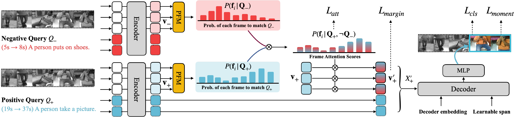

# Background-aware Moment Detection for Video Moment Retrieval
[](https://paperswithcode.com/sota/moment-retrieval-on-charades-sta?p=overcoming-weak-visual-textual-alignment-for)
[](https://paperswithcode.com/sota/moment-retrieval-on-qvhighlights?p=overcoming-weak-visual-textual-alignment-for)



PyTorch Implementation of paper:

**[Background-aware Moment Detection for Video Moment Retrieval](https://arxiv.org/abs/2306.02728)**

[Minjoon Jung](https://minjoong507.github.io/), [Youwon Jang](https://github.com/greeksharifa), Seongho Choi, [Joochan Kim](https://tikatoka.github.io) [Jin-Hwa Kim](http://wityworks.com/), [Byoung-Tak Zhang](https://bi.snu.ac.kr/~btzhang/)
## Updates
* [Aug, 2024] Our paper has been accepted by WACV 2025.
* [Dec, 2023] Our codes have been released.
* [Nov, 2023] Our preprint has been updated on arXiv.

## Requirements

To install requirements:

Please refer to [here](data/README.md).

To install dependencies:

We recommend creating a conda environment and installing all the dependencies as follows:
```
# create conda env
conda create --name bm_detr python=3.9
# activate env
conda actiavte bm_detr
# install pytorch
conda install pytorch==1.13.1 torchvision==0.14.1 torchaudio==0.13.1 pytorch-cuda=11.6 -c pytorch -c nvidia
# install other python packages
pip install tqdm ipython easydict tensorboard tabulate scikit-learn pandas
```

## Released Models and Features

We provide extracted video/text features and released BM-DETR models.

These pre-trained models will report the performances as reported in the table below.


| Dataset                    | Feat                                                                                           | Split     | R@1, IoU=0.5 | R@1, IoU=0.7 | Checkpoint                                                                                       |
|----------------------------|------------------------------------------------------------------------------------------------|-----------|--------------|--------------|--------------------------------------------------------------------------------------------------|
| Charades-STA (C3D)         | [[Link]](https://drive.google.com/drive/folders/1C9dPyME9i5V2_bYqK4YDVyUQltmaaHiu?usp=sharing) | test      | 55.78        | 34.27        | [[Link]](https://drive.google.com/drive/folders/1VUsFRYHAyHED9qES37pKqZahuvTxWTqP?usp=sharing)   |
| Charades-STA (VGG)         | [[Link]](https://drive.google.com/drive/folders/1C9dPyME9i5V2_bYqK4YDVyUQltmaaHiu?usp=sharing) | test      | 58.01        | 36.91        | [[Link]](https://drive.google.com/drive/folders/1xyoQ2K6sI9B_bCFN5df3hwaL5u2ZqA43?usp=sharing)   |
| Charades-STA (SF+C)        | [[Link]](https://drive.google.com/drive/folders/1C9dPyME9i5V2_bYqK4YDVyUQltmaaHiu?usp=sharing) | test      | 59.57        | 39.17        | [[Link]](https://drive.google.com/drive/folders/1ykPRrYZtd-V4b1sD_vG1bN3ukmltIZSH?usp=sharing)   |
| QVHighlights (SF+C)        | [[Link]](https://drive.google.com/file/d/1Hiln02F1NEpoW8-iPZurRyi-47-W2_B9/view?usp=sharing)   | val       | 61.94        | 47.16        | [[Link]](https://drive.google.com/drive/folders/1otXSq2gkPdlheqjCwqF3Kii-vUE8sk2V?usp=sharing)   |
| Charades-CD (I3D)          | [[Link]](https://drive.google.com/drive/folders/1EiypIk4Mb2zQiHv611RRy6ZLhN1mOEC5?usp=sharing) | test-ood  | 53.60        | 30.18        | [[Link]](https://drive.google.com/drive/folders/1ppX9btLdTnp8r3T58bhUGVmgEdoiadaL?usp=sharing)   |

If you have downloaded the features and checkpoints, please check the `opt.json` and put them in the correct path.

The reproduced performance may differ slightly from the performance reported in the paper.

More pre-trained models coming soon, so stay tuned!

### Training

Training can be launched by running the following command:
```
bash bm_detr/scripts/train_{dset_name}.sh
```

For `Charades-STA`, you can choose `v_feat_type` which can be one of `slowfast_clip`, `c3d`, or `vgg`.

```
bash bm_detr/scripts/train_charades.sh {v_feat_type}
```

For more model options, please check our config file `bm_detr/config.py`.

The checkpoints and other experiment log files will be written into `results/results_{dset_name}`.

### Inference
You can use the following command for inference to check the performance of trained model:

```
bash bm_detr/scripts/inference_{dset_name}.sh CHECKPOINT_FILE_PATH SPLIT_NAME  
```

where `CHECKPOINT_FILE_PATH` is the path to the saved checkpoint, `SPLIT_NAME` is the split name for inference.

For `QVHighlights`, we automatically generate the predictions for `val` and `test_public` splits and save the results to `submission`:

```
bash bm_detr/scripts/inference_qv.sh RESULT_PATH  
``` 

where `RESULT_PATH` is the path to the `result_dir` in our config file `bm_detr/config.py`.

Please check the `inference_{dset_name}.sh` for setting right evaluation path and split name.

## Acknowledgement

We used resources from [MDETR](https://github.com/jayleicn/moment_detr) and [DAB-DETR](https://github.com/IDEA-Research/DAB-DETR).  We thank for the authors for making their projects open-sources.

## Citation
If you find our project useful in your work, please consider citing our paper.
```
@article{jung2023overcoming,
  title={Overcoming Weak Visual-Textual Alignment for Video Moment Retrieval},
  author={Jung, Minjoon and Jang, Youwon and Choi, Seongho and Kim, Joochan and Kim, Jin-Hwa and Zhang, Byoung-Tak},
  journal={arXiv preprint arXiv:2306.02728},
  year={2023}
}
```

## Contact

This project is maintained by [Minjoon Jung](https://minjoong507.github.io/). 
If you have any questions, please feel free to contact via mjjung@bi.snu.ac.kr.
